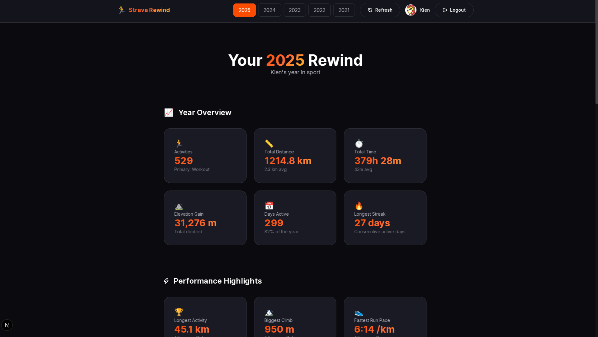

<div align="center">
    
    <h1>🏃 Strava Rewind</h1>
    <p>A Year In Sport without paying extra fee</p>
    
    
    
    
    
</div>

Table of Contents:

- [1. Features](#1-features)
- [2. Getting Started](#2-getting-started)
  - [2.1. Prerequisites](#21-prerequisites)
  - [2.2. Setup Strava API](#22-setup-strava-api)
  - [2.3. Installation](#23-installation)
  - [2.4. Environment Variables](#24-environment-variables)
  - [2.5. Run](#25-run)
- [3. Screenshots](#3-screenshots)
  - [3.1. Landing Page](#31-landing-page)
  - [3.2. Dashboard](#32-dashboard)

> [!IMPORTANT]
> **Why do I create this?** The Strava Year in Sport stats round-up of a user's activity from the past 12 months is along the lines of similar features offered by other apps, such as Spotify Wrapped. However, while many, like Spotify, give all users the round-up regardless of if they use the free version or pay for a subscription, Strava has put its Year in Sport behind a paywall as a paid feature.
>
> If you wonder, the [logo.png](./images/logo.png) is generated by Gemini Nano Banana Pro.

## 1. Features

- **Complete Statistics** - Distance, time, elevation, and more for every sport
- **Streaks & Consistency** - Your longest streaks, most active days, training patterns
- **Performance Highlights** - Fastest runs, longest rides, biggest climbs
- **Location Tracking** - Countries and cities where you trained
- **Personal Insights** - Unique insights tailored to your habits

## 2. Getting Started

### 2.1. Prerequisites

- [Bun](https://bun.sh/) installed
- A [Strava](https://www.strava.com/) account
- Strava API credentials

### 2.2. Setup Strava API

1. Go to [Strava API Settings](https://www.strava.com/settings/api)
2. Create an application
3. Set **Authorization Callback Domain** to `<yourdomain>` (If you run it locally, just enter `localhost`)
4. Note your **Client ID** and **Client Secret**

### 2.3. Installation

```bash
# Clone the repository
git clone https://github.com/ntk148v/strava-rewind.git
cd strava-rewind

# Install dependencies
bun install

# Copy environment file
cp .env.example .env.local

# Edit .env.local with your Strava credentials
```

### 2.4. Environment Variables

```env
STRAVA_CLIENT_ID=your_client_id
STRAVA_CLIENT_SECRET=your_client_secret
NEXT_PUBLIC_APP_URL=http://localhost:3000
```

### 2.5. Run

```bash
# Development
bun run dev

# Production build
bun run build
bun run start
```

Visit `http://localhost:3000` and click **Connect with Strava**!

## 3. Screenshots

### 3.1. Landing Page

Connect with your Strava account to get started.


### 3.2. Dashboard

View your complete year in sport with statistics, insights, and more.


